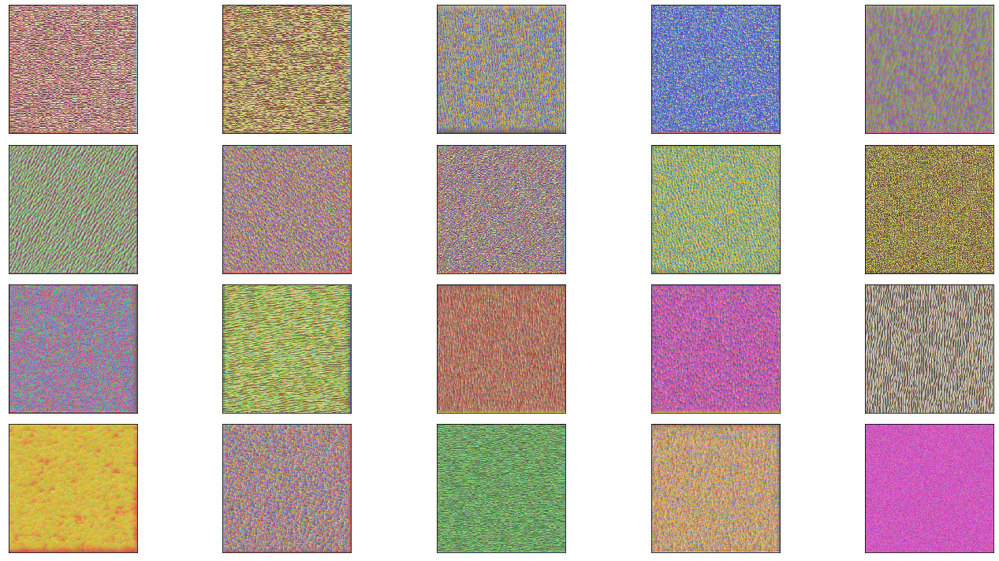
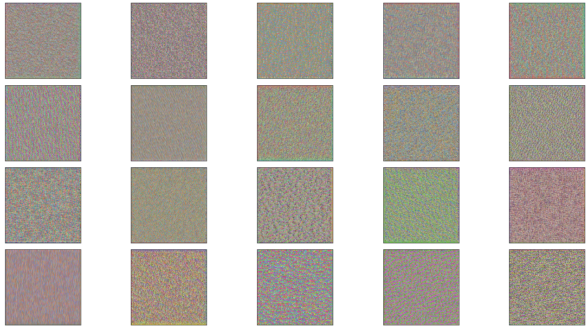
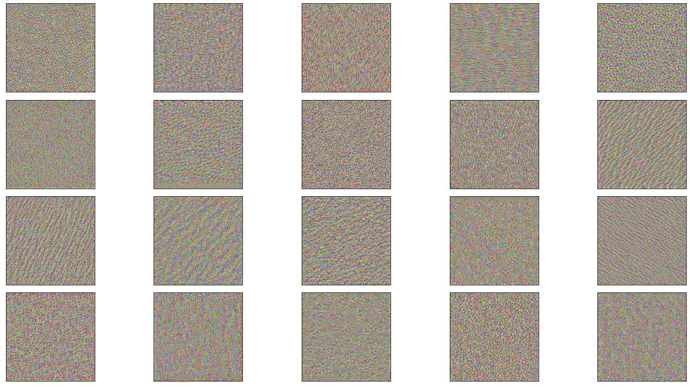
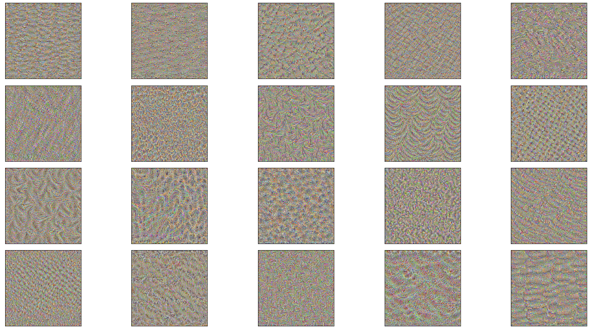
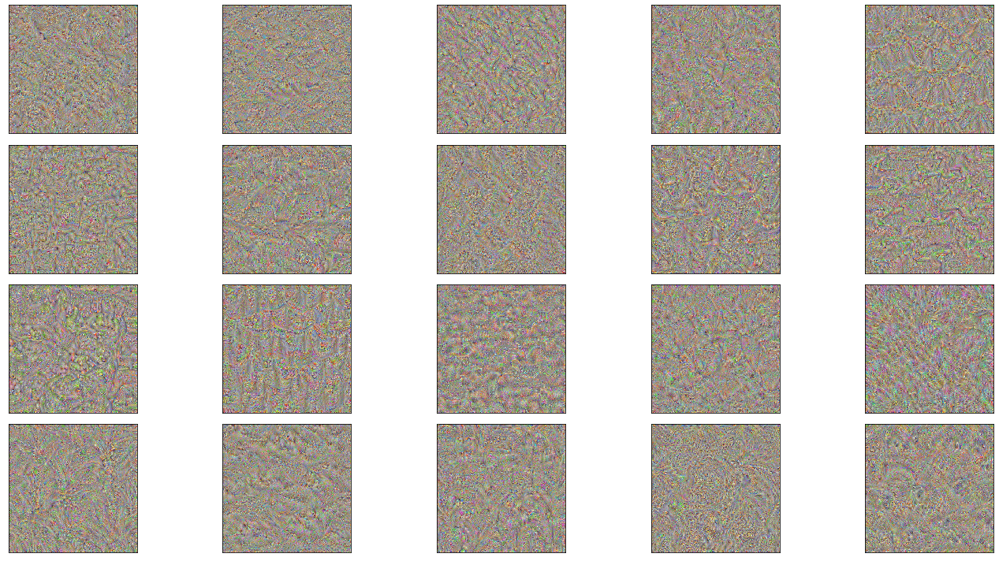
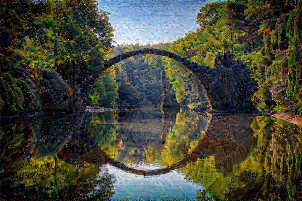
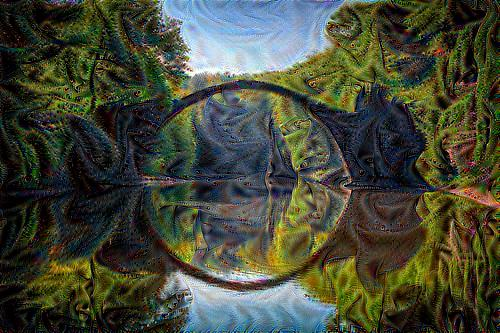

# CNN - Visualization

Using vgg16 to visualize what CNN "sees"

Applying it to image to change the effect.

## Result

### Conv1-2

### Conv2-2

### Conv3-3

### Conv4-3

### Conv5-3

### Applying to picture

 

**Framework**: Pytorch
